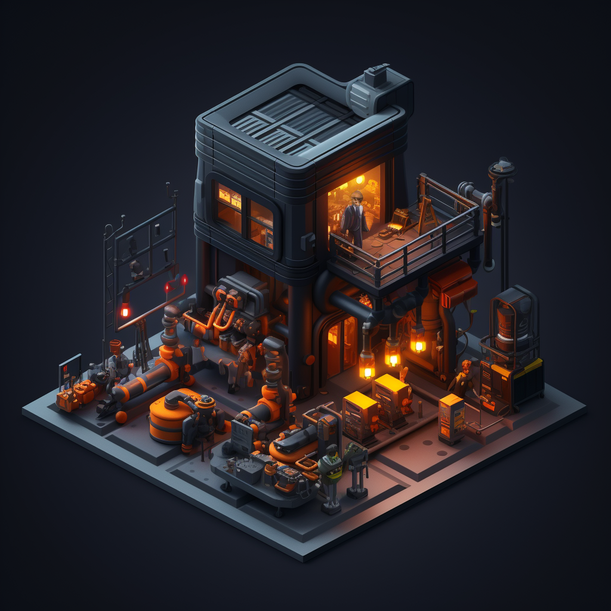

# Square + Google Hackathon 2023
  
## Task Matic
What is it?
TaskMatic is a groundbreaking platform that integrates blockchain, AI-driven agents, and secure payment services to transform task management. Powered by Google Vertex APIs, it enables proprietary AI models to operate within an open and transparent ecosystem. Smart contracts ensure trust and decentralization, while SQUARE payment services streamline transactions using ERC-20 tokens.

TaskMatic empowers users to extend agents and verifiers through open interfaces, fostering innovation. Experience a new era of efficient, transparent, and trusted task management with TaskMatic, revolutionizing the way tasks are organized and executed.

## Submission Components
Google Project Id: project=affable-visitor-401801
Square Project Id: sandbox-sq0idb-zMRsz8p2M6MYEmg2_Aq15g
Website: https://task-matic.netlify.app/
Github Repository: https://github.com/victaphu/task-matic-submission
Video: https://youtu.be/inwiRgGPjKE

## Components
* Google Generative AI using Vertex AI for Verifiers and Agents running autonomously on the blockchain
* Polygon matic smart contracts as a decentralised framework for agents, tasks and verifiers + payments
* Integration with Square to allow users to pay for services as well as for agents and verifiers to receive payments
* Simple User interface to allow users to submit tasks

## Setup

Setup .env.nodejs with the following:
```
GOOGLE_APPLICATION_CREDENTIALS=<ADC credentials file>

# don't bother these private keys are empty and from Ganache-cli!
PRIVATE_KEY=0xdf282f5fee16b5acc81c0b85024701242b4899bb30da2a8b6163a1bd3313f623
AGENT_PRIVATE_KEY=0x0e1f09bbb1c4b1fee20694fd6686fe96d37df28d4bad1518d42657cb47f338fe
VERIFIER_PRIVATE_KEY=0xaf30484ab22087ff0c668b429adc91629e1b3f72d34e9f8fc137372b5d9bb161
USER_PRIVATE_KEY=0x0e1ee6dd73ed031b07a2b204b1da794b9bf718e27df9a8dd4107939991f66169

# if you're running localhost these configs will be correct
# we're using default values generated the first time you run 
# npm run deploy-contract
ERC20_ADDRESS=0x7581a34d18B3c31f2f8101EF223E96350c1000dF
TASKMANAGER_ADDRESS=0x68134c2D0138Cd2E811d275062e88BaE35A9fcA6

AGENT1_ADDRESS=0xD32687f7328D00330C44F0d6417949136427dFdE
AGENT2_ADDRESS=0x5d1b1755D2FCeFAe507124300F493DFb3aD1875e
VERIFIER1_ADDRESS=0xD078f034b419adF5075cbDbA8854A6C802901991
VERIFIER2_ADDRESS=0xf694C347Bd9C21C81677aBb6806B0C576d624CEa

RPC_RPC=http://127.0.0.1:8545
```

* Install Ganache (`npm install -g ganache-cli`)
* Run script to deploy smart contracts (`npm run deploy-contract`)
* Start the agents `(npm run run-agent and npm run run-verifier)`
* Start the user interface (`cd ui; npm run dev`)
* Configure a google account that supports Google Vertex AI and setup the ADC (https://cloud.google.com/docs/authentication/provide-credentials-adc#local-dev)
* Use an account from the ganache-cli by adding the private key to your metamask (e.g. 0x0e1ee6dd73ed031b07a2b204b1da794b9bf718e27df9a8dd4107939991f66169)
